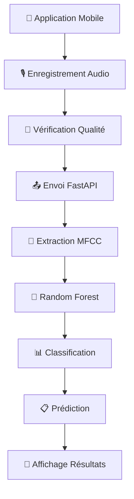

<p align="center">
  
</p>

# AI-Breath : Détection de Troubles Respiratoires via l'Analyse Acoustique

[](https://android.com)
[](https://python.org)
[](https://fastapi.tiangolo.com)
[](https://android-arsenal.com/api?level=21)
[](https://github.com/ahmed-elhamri/AI-BREATH)
[](https://github.com/ahmed-elhamri/AI-BREATH/releases)

> AI-Breath est une plateforme web et mobile interactive dédiée à la détection précoce des troubles respiratoires par l'analyse acoustique intelligente utilisant l'apprentissage automatique et le traitement des signaux bioacoustiques.

## 📋 Table des Matières

- [Description](#-description)
- [Fonctionnalités](#-fonctionnalités)
- [Technologies](#-technologies)
- [Architecture](#️-architecture)
- [Captures d'écran](#-captures-décran)
- [Installation](#-installation)
- [Utilisation](#-utilisation)
- [Performance](#-performance)
- [Limitations](#-limitations)
- [Améliorations Futures](#-améliorations--futures)
- [Roadmap](#️-roadmap)
- [Contribution](#-contribution)
- [Équipe](#-équipe)

## 🩺 Description

AI-Breath est une solution innovante qui exploite l'intelligence artificielle pour transformer un simple enregistrement respiratoire en diagnostic médical préliminaire. En utilisant des algorithmes d'apprentissage automatique avancés, l'application peut détecter des pathologies comme l'asthme et l'apnée du sommeil avec une précision de **92,35%**.

### 🎯 Pourquoi AI-Breath ?

- **🏥 Diagnostic précoce** : Détection non-invasive des troubles respiratoires
- **🌍 Accessibilité universelle** : Disponible partout avec un smartphone
- **⚡ Analyse instantanée** : Résultats en temps réel via IA
- **💰 Solution économique** : Alternative abordable aux examens coûteux
- **🔬 Base scientifique** : Modèles entraînés sur des échantillons

### 🌟 Impact Médical

AI-Breath révolutionne l'accès aux soins respiratoires, particulièrement dans les zones à ressources limitées. La plateforme favorise l'intervention précoce, réduit le recours aux examens invasifs et constitue un outil précieux pour la télémédecine et la recherche épidémiologique.

## 🚀 Fonctionnalités

### 🎙️ Enregistrement Audio Intelligent

- Capture optimisée des sons respiratoires (10s, 44.1kHz, format WAV)
- Interface intuitive avec bouton d'enregistrement principal
- Possibilité de ré-enregistrement immédiat

### 🧠 Analyse IA Avancée

| Technologie       | Fonction                    | Performance        |
| ----------------- | --------------------------- | ------------------ |
| **Random Forest** | Classification principale   | 92,35% précision   |
| **MFCC**          | Extraction caractéristiques | Analyse spectrale  |
| **Librosa**       | Traitement signal           | Optimisation audio |
| **FastAPI**       | Backend IA                  | Réponse < 2s       |

### 📊 Diagnostic Complet

- **Détection multi-pathologies** : Normale, Asthme, Apnée du sommeil
- **Rapports personnalisés** : Probabilités

## 🛠️ Technologies

### 📱 Frontend Mobile (Android)

```
☕ Java - Développement natif
🎨 Material Design - Interface moderne
🔄 Retrofit 2.9.0 - Communication API
📡 HTTP Client - Échange données sécurisé
💾 MVVM Architecture - Code maintenable
🎵 AudioRecorder API - Capture audio optimisée
```

### 🐍 Backend Intelligence

```
🚀 FastAPI - Framework web moderne
🎼 Librosa - Traitement signal audio
🔢 NumPy - Calculs scientifiques
🤖 Scikit-learn - Machine Learning
💾 Joblib - Sérialisation modèles
⚡ Uvicorn - Serveur ASGI performant
```

### 🧮 Algorithmes IA

```
🌳 Random Forest - Classification principale
📊 MFCC - Coefficients cepstraux
📈 Feature Extraction - Caractéristiques audio
🎯 Pattern Recognition - Détection pathologies
📐 Signal Processing - Traitement numérique
```

## 🏗️ Architecture

### 🔄 Flux de Données Intelligent




### 🏛️ Architecture Modulaire

| Couche                | Responsabilité           | Technologies                 |
| --------------------- | ------------------------ | ---------------------------- |
| **🎨 Présentation**   | Interface utilisateur    | Android SDK, Material Design |
| **💼 Logique Métier** | MVVM, Repository Pattern | Java, Retrofit               |
| **🌐 Communication**  | API REST, Sérialisation  | HTTP, JSON                   |
| **🧠 Intelligence**   | Traitement IA            | Python, FastAPI              |
| **🔬 Analyse**        | ML, Signal Processing    | Scikit-learn, Librosa        |

## 📱 Captures d'écran

<div align="center">
<table>
  <tr>
    <td align="center">
      
      <br><strong>🏠 Interface Principale</strong><br>
      <sub>Bouton d'enregistrement central</sub>
    </td>
    <td align="center">
      
      <br><strong>🎙️ Enregistrement Audio</strong><br>
      <sub>Enregistrement Audio</sub>
    </td>
    <td align="center">
      
      <br><strong>🔊 Vérification Audio</strong><br>
      <sub>Écoute et validation</sub>
    </td>
    <td align="center">
      
      <br><strong>📊 Diagnostic IA</strong><br>
      <sub>Prédiction</sub>
    </td>
  </tr>
</table>
</div>

### 🎯 Interface en 3 Étapes

1. **🎙️ Enregistrement** : Interface épurée avec bouton principal
2. **✅ Vérification** : Écoute, ré-enregistrement ou validation
3. **📋 Diagnostic** : Prédiction

## 📦 Installation

### ⚙️ Prérequis Système

| Composant      | Version Minimale      | Recommandée   |
| -------------- | --------------------- | ------------- |
| **📱 Android** | API 21+ (Android 5.0) | API 30+       |
| **🐍 Python**  | 3.8.1+                | 3.10+         |
| **💾 RAM**     | 2GB                   | 4GB+          |
| **📶 Réseau**  | 3G/WiFi               | 4G/WiFi       |
| **🔊 Audio**   | Microphone intégré    | Micro externe |

### 🚀 Installation Rapide

#### 1. **📥 Clonage du Repository**

```bash
git clone https://github.com/ahmed-elhamri/AI-BREATH.git
cd AI-BREATH
```

#### 2. **🐍 Configuration Backend Python**

```bash
# Dépendances principales
pip install fastapi==0.68.0
pip install librosa==0.9.1
pip install numpy==1.21.0
pip install scikit-learn==1.0.2
pip install joblib==1.0.1
pip install uvicorn==0.15.0
```

#### 3. **🚀 Lancement du Serveur**

```bash
# Démarrage FastAPI
uvicorn main:app --host 0.0.0.0 --port 8000 --reload

# Vérification API
curl http://localhost:8000/
```

#### 4. **📱 Configuration Mobile**

Modifiez `/front-end/app/src/main/java/com/example/ai_breath/repository/AudioRepository.java`:

```java
//...
public AudioRepository() {
        Retrofit retrofit = new Retrofit.Builder()
                .baseUrl("http://VOTRE_IP:8000/api/v1/")
                .addConverterFactory(GsonConverterFactory.create())
                .build();

        apiService = retrofit.create(ApiService.class);
    }
//...
```

#### 5. **🔐 Permissions Android**

Dans `AndroidManifest.xml` :

```xml
<!-- 🎙️ Enregistrement audio -->
<uses-permission android:name="android.permission.RECORD_AUDIO" />
<uses-permission android:name="android.permission.WRITE_EXTERNAL_STORAGE" />

<!-- 🌐 Communication réseau -->
<uses-permission android:name="android.permission.INTERNET" />
```

## 📖 Utilisation

### 🎯 Guide Utilisateur Simple

#### **Étape 1 : 🎙️ Enregistrement**

1. Ouvrez l'application AI-Breath
2. Positionnez le smartphone près de la bouche (15-20cm)
3. Appuyez sur le bouton d'enregistrement central
4. Respirez naturellement

#### **Étape 2 : ✅ Vérification**

- **🔊 Écouter** : Vérifiez la qualité de l'enregistrement
- **🔄 Recommencer** : Si la qualité n'est pas satisfaisante
- **✅ Analyser** : Lancer l'analyse IA

#### **Étape 3 : 📊 Diagnostic**

- **📋 Résultats** : Classification automatique (Normal/Asthme/Apnée)

## 📈 Performance

### 🎯 Métriques du Modèle IA

| Métrique                     | Valeur     | Interprétation                |
| ---------------------------- | ---------- | ----------------------------- |
| **🎯 Précision Globale**     | **92,35%** | Excellent niveau de fiabilité |
| **📊 Précision (Precision)** | 91,2%      | Faible taux faux positifs     |
| **🔍 Rappel (Recall)**       | 93,1%      | Détection complète des cas    |
| **⚖️ Score F1**              | 92,1%      | Équilibre optimal             |
| **⚡ Temps Réponse**         | < 2s       | Analyse temps réel            |

## 🔒 Limitations

- **🩺 Non-diagnostic médical** : Outil d'aide à la décision uniquement
- **🔊 Qualité audio** : Sensible aux bruits environnementaux
- **👥 Populations** : Optimisé pour adultes (18-65 ans)
- **🌐 Connectivité** : Nécessite connexion internet pour analyse

## 🔮 Améliorations Futures

- **📊 Déséquilibre classes** : Enrichissement dataset
- **🎭 Similarité acoustique** : Affinage extraction caractéristiques
- **🌍 Généralisation** : Validation environnements variés
- **🔬 Pathologies rares** : Extension spectre détection

## 🗺️ Roadmap

### 📅 Version 1.1 (Q3 2025)

- [ ] 🧠 **Modèles CNN** : Réseaux convolutifs pour extraction auto
- [ ] 📱 **Mode hors-ligne** : Inférence locale sur appareil
- [ ] 👨‍⚕️ **Téléconsultation** : Connexion directe professionnels
- [ ] 📊 **Tableaux de bord** : Analytics avancés utilisateur

### 📅 Version 1.5 (Q4 2025)

- [ ] 🌍 **Multi-langues** : Support international complet
- [ ] 👶 **Pédiatrie** : Adaptation algorithmes enfants
- [ ] 🔊 **Qualité audio** : Amélioration robustesse bruit
- [ ] 📈 **Tendances** : Suivi longitudinal santé

### 📅 Version 2.0 (2026)

- [ ] 🩺 **Nouvelles pathologies** : BPCO, pneumonie, COVID-19
- [ ] 🧬 **IA explicable** : Transparence algorithmes médicaux
- [ ] 🏥 **Intégration HIS** : Systèmes information hospitaliers
- [ ] 🌐 **API publique** : Plateforme développeurs

### 🔬 Vision Long Terme

- [ ] 🤖 **IA prédictive** : Anticipation crises respiratoires
- [ ] 📡 **IoT médical** : Intégration dispositifs connectés
- [ ] 🧪 **Recherche** : Plateforme études épidémiologiques
- [ ] 🌍 **Santé publique** : Surveillance populations

## 🤝 Contribution

### 🌟 Comment Contribuer

Nous accueillons toutes les contributions pour améliorer AI-Breath !

#### 🔧 **Développement**

1. **🍴 Fork** le repository
2. **🌿 Branche** : `git checkout -b feature/nouvelle-fonctionnalite`
3. **💾 Commit** : `git commit -m "Add: Description claire"`
4. **📤 Push** : `git push origin feature/nouvelle-fonctionnalite`
5. **🔄 Pull Request** avec description détaillée

#### 📋 **Guidelines Contribution**

| Type                 | Description              | Convention               |
| -------------------- | ------------------------ | ------------------------ |
| **🔬 Scientifique**  | Amélioration algorithmes | Tests performance requis |
| **📱 Mobile**        | Interface utilisateur    | Material Design          |
| **🐍 Backend**       | API et traitement        | Documentation FastAPI    |
| **🧪 Testing**       | Tests automatisés        | Coverage > 80%           |
| **📚 Documentation** | Guides et références     | Markdown + exemples      |

#### 🎯 **Domaines Prioritaires**

- 🧠 **Algorithmes ML** : Nouveaux modèles et optimisations
- 🔊 **Signal Processing** : Amélioration qualité audio
- 🏥 **Validation Médicale** : Tests avec professionnels
- 🌍 **Accessibilité** : Support populations diverses
- 📊 **Performance** : Optimisation vitesse et précision

## 👥 Équipe

### 👨‍💻 Développeurs Principaux

<table>
  <tr>
    <td align="center">
      <br>
      <sub><b>Omar EL Amrani</b></sub><br>
      <sub>École Marocaine des Sciences d'Ingénieur</sub><br>
    </td>
    <td align="center">
      <br>
      <sub><b>Ahmed EL Hamri</b></sub><br>
      <sub>École Marocaine des Sciences d'Ingénieur</sub><br>
    </td>
    <td align="center">
      <br>
      <sub><b>Prof. Mohamed Lachgar</b></sub><br>
      <sub>🎓 Encadrant Académique</sub><br>
      <sub>École Marocaine des Sciences d'Ingénieur</sub><br>
    </td>
  </tr>
</table>

### 🎓 Institution

**École Marocaine des Sciences d'Ingénieur (EMSI)**

- 📍 Marrakesh, Morocco
- 🌐 [Site Web EMSI](https://www.emsi.ma)
- 🎯 Formation ingénieurs informatique et IA

## 🌐 Liens Utiles

- **📱 Application** : [Google Play Store](https://play.google.com/store/apps/details?id=com.aibreath) _(à venir)_
- **💻 Code Source** : [GitHub Repository](https://github.com/ahmed-elhamri/AI-BREATH)
- **📊 API Documentation** : [FastAPI Docs](http://api.ai-breath.ma/docs) _(développement)_
- **🎓 Article Scientifique** : [ResearchGate](https://researchgate.net/ai-breath-paper) _(soumission)_

---

## 📚 Citation Académique

```bibtex
@article{elamrani2025aibreath,
  title={AI-Breath: Détection de Troubles Respiratoires via l'Analyse Acoustique},
  author={EL Amrani, Omar and EL Hamri, Ahmed and Lachgar, Mohamed},
  journal={École Marocaine des Sciences d'Ingénieur},
  year={2025},
  institution={EMSI Marrakesh},
  url={https://github.com/ahmed-elhamri/AI-BREATH}
}
```

---

<div align="center">

## 🩺 **Respirez Plus Intelligemment avec AI-Breath** 🩺

[](https://github.com/ahmed-elhamri/AI-BREATH)
[](https://github.com/ahmed-elhamri/AI-BREATH)
[](https://github.com/ahmed-elhamri/AI-BREATH)

### 🏆 **92,35% de Précision | 🌍 Accessible Partout | ⚡ Analyse Instantanée**

---

_"Démocratiser l'accès au dépistage respiratoire grâce à l'Intelligence Artificielle"_

**🎓 Projet Académique EMSI Marrakesh | 🇲🇦 Made in Morocco with ❤️**

</div>
